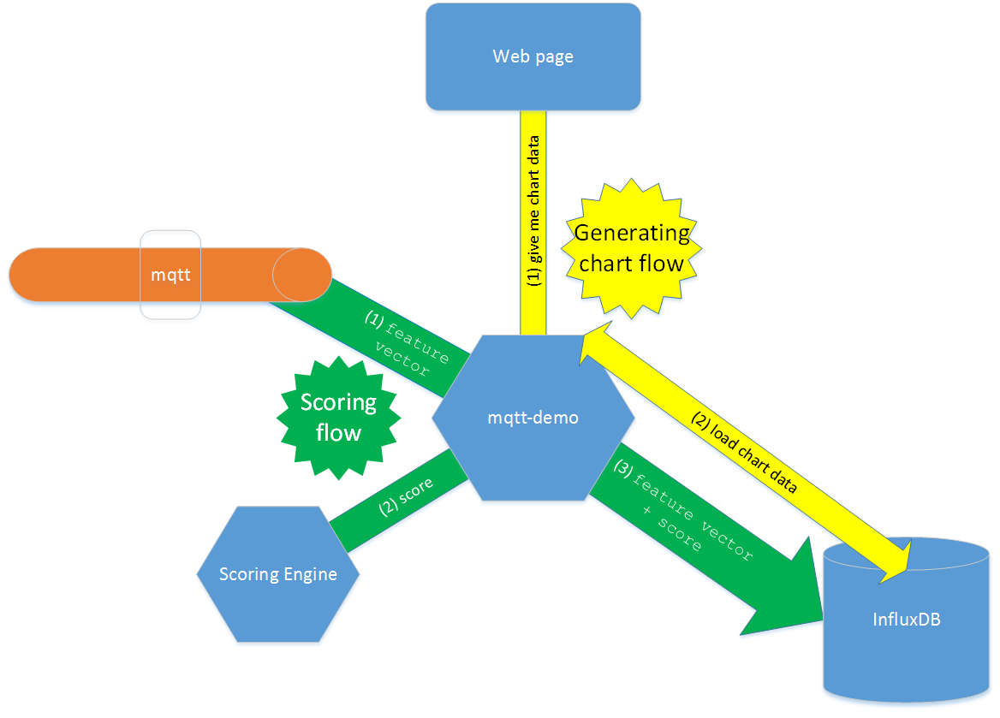
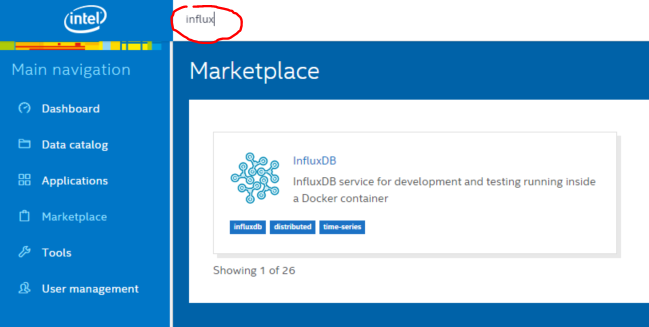
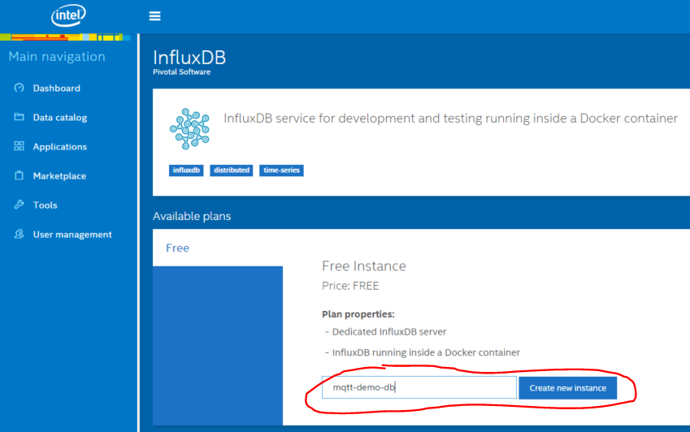
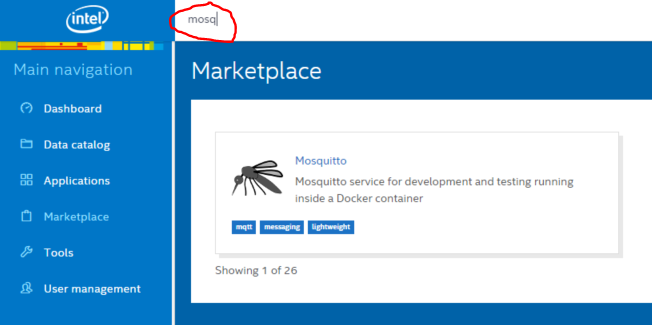
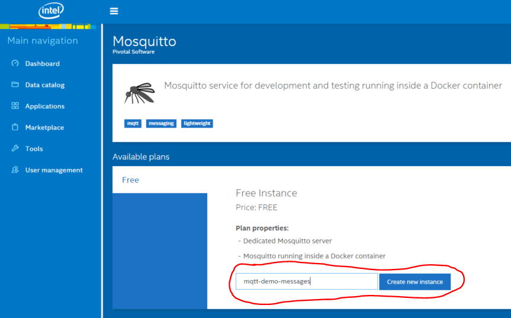

# mqtt-demo
Sample application using MQTT on Trusted Analytics platform

### Overview
Application use dataset https://archive.ics.uci.edu/ml/datasets/Statlog+%28Shuttle%29 to test data ingestion flow with mosquitto. Dataset is present also in this repository (tools directory). User should send data vector by vector on proper mosquitto topic. Bash script from tools directory of this repository can be used. Each data vector consist of class value (integer 1-7) and nine feature values (float 0.0-1.0), eg.

```1.0, -0.616162, -0.0254648, 0.015625, 0.0140301, -0.25, 0.0259755, 0.150327, 0.258427, 0.144695```

Application get messages from mosquitto and send them to Scroing Engine (SE). SE is an application which is teached to detect anomalies in feature vectors. When anomaly is detected, mqtt-demo stores timestamp and class value in InfluxDB (time-series database). Data stored in database is visible in a website.

**For purpose of learning/testing mosquitto ingestion flow you don't need to know more about SE and InfluxDB.**



#### Scoring flow:
1. Application mqtt-demo listens to MQTT topic and waits for feature vectors.
2. When a MQTT message appears, application asks Scoring Engine to classify received feature vector.
3. Application stores scoring result in InfluxDB.

#### Generating graph flow:
1. Web application asks backend application (mqtt-demo) for a anomalies chart.
2. Mqtt-demo gets anomalies (classes different than 1) count per minute from InfluxDB.


## Data Ingestion
This section should be most important if you want to see how to send data to application running in Trusted Analytics platform using mosquitto. Instructions below shows how to deploy sample application on platform and how to ingest data from local machine.

#### Create required services on Trusted Analytics platform
Before deploying application you should create two services on platform. You can do it from command line, but below instructions shows how to do it using web UI.
* Create InfluxDB instance (it should be named **mqtt-demo-db** or you need to change this name in ```manifest.yml``` and ```src/main/application.yml```)




* Create Mosquitto instance (it should be named **mqtt-demo-messages** or you need to change this name in ```manifest.yml``` and ```src/main/application.yml```)




#### Build and push application to Trusted Analytics platform
```
mvn clean package
cf push
```

#### Add information on scoring engine
Check if user-provided service atkscoreengine exists, if not - add it to Cloudfoundry:
```
cf cups atkscoreengine -p '{"baseUrl":"atk-scoringengine.example.com"}'
```

There should be information added in environment variables about scoring engine URL. Required variable is baseUrl:
'''
{
    "credentials": {
     "baseUrl": "atk-scoringengine.example.com"
    },
    "label": "user-provided",
    "name": "atkscoreengine",
    "syslog_drain_url": "",
    "tags": []
   }

'''

#### Get mosquitto credentials
After your application is pushed, you can type ```cf env mqtt-demo``` in your terminal. You should see JSON object. The most interesting part is  mosquitto credentials:
```
"mosquitto": [
  {
    "credentials": {
      "port": "32826",
      "ports": {
        "1883/tcp": "32826"
      },
      "username": "sample_user",
      "password": "sample_pass"
    },
    "name": "mqtt-demo-messages",
     ..........
  }
]
```
You will need **port**, **username** and **password** to connect to mosquitto instance and ingest data to your application.

#### Install mosquitto clients on your local machine
```
sudo apt-add-repository ppa:mosquitto-dev/mosquitto-ppa
sudo apt-get update						
sudo apt-get install mosquitto-clients	
```

#### Run ingestion script
In a terminal:
```
cd tools
vim ingest_mqtt.sh
  {edit first two lines of this file}
    {change HOST from 'localhost' to 'mqtt.<platform-domain>'}
    {change PORT from '1883' to 'port' acquired in "Get mosquitto credentials" section}
./ingest_mqtt.sh
{enter username - the same that you get in ""Get mosquitto credentials" section}
{enter password - the same that you get in "Get mosquitto credentials" section}
```


## Local development
#### Prerequisites
* InfluxDB
  * You need to install and run it locally. You can find instruction here: http://influxdb.com/docs/v0.8/introduction/installation.html
  ```
  wget http://s3.amazonaws.com/influxdb/influxdb_latest_amd64.deb
  sudo dpkg -i influxdb_latest_amd64.deb
  ```         
  Configuration file is located at ```/opt/influxdb/shared/config.toml``` or ```/usr/local/etc/influxdb.conf```
  There you can check or change ports used by InfluxFB. By default there will be 8083, 8086, 8090, and 8099.

  To start InfluxDB type: ```sudo /etc/init.d/influxdb start```
  
  You can then access admin panel, by default accessible at: ```localhost:8083```
  
  After going there for first time, remember to create username and password. ```root:root``` seems to be a good choice.
  
* Mosquitto
 * Install:
  ```
  sudo apt-add-repository ppa:mosquitto-dev/mosquitto-ppa
  sudo apt-get update		
  sudo apt-get install mosquitto					
  sudo apt-get install mosquitto-clients	
  ```
 * Secure your local instance:
  ```
  cd /etc/mosquitto/
  mosquitto_passwd -c passwordfile {username - default one is "mqtt-demo"}
  	{enter password - default one is "test"}
  sudo vim /etc/mosquitto/mosquitto.conf
  	{add lines}
  		allow_anonymous false
  		password_file /etc/mosquitto/passwordfile
  sudo service mosquitto restart
  ```
  
#### Run
```mvn spring-boot:run```

#### Ingest data locally
When application is running:
 * In a terminal:
```
cd tools
./ingest_mqtt.sh
{enter username - the same that you set in "Secure your local instance" section}
{enter password - the same that you set in "Secure your local instance" section}
```
 * In a web browser:
  * Enter ```localhost:8080```
  * Wait few minutes - some annomalies should appear in the chart
